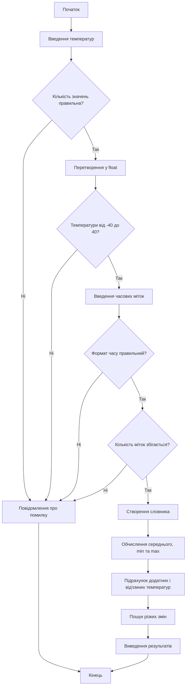

# Лабораторна робота №1  
# Виконав студент групи: ІКМ-724в
# Матвейчук С. В.
## Засвоєння основ мови програмування Python

### Мета роботи

Створити програму мовою Python, яка приймає дані від користувача, виконує їх перевірку та обробку, а також виводить результати аналізу температурних показників.

Під час виконання лабораторної роботи необхідно закріпити навички роботи з основними типами даних Python, списками, словниками, умовними операторами та циклами.

---

## 1. Опис завдання

Необхідно написати програму для аналізу температурних показників за день.

Користувач вводить до 24 значень температури одним рядком через пробіл. Температура повинна знаходитись у діапазоні від -40 до +40 °C.

Після цього користувач вводить часові мітки для кожного вимірювання у форматі `година:хвилина`.

На основі введених даних програма повинна:

- перевірити правильність введених температур;
- перевірити правильність часових міток;
- створити словник, у якому ключем є час, а значенням — температура;
- визначити середню температуру;
- знайти мінімальну та максимальну температуру;
- визначити кількість додатних і від'ємних температур;
- знайти різкі зміни температури між сусідніми вимірюваннями, якщо різниця перевищує 7 °C;
- вивести отримані результати на екран.

---

## 2. Алгоритм роботи програми

Алгоритм роботи програми складається з таких етапів:

1. Вивести інформацію про початок роботи програми.
2. Отримати від користувача температурні значення.
3. Розділити введений рядок на окремі елементи.
4. Перевірити кількість введених значень.
5. Перетворити кожне значення температури у тип `float`.
6. Перевірити, чи знаходиться температура у допустимому діапазоні від -40 до +40 °C.
7. Отримати від користувача часові мітки.
8. Перевірити правильність формату часу.
9. Перевірити відповідність кількості температур і часових міток.
10. Створити словник виду `час: температура`.
11. Обчислити середню температуру.
12. Визначити мінімальну та максимальну температуру.
13. Підрахувати кількість додатних та від'ємних значень.
14. За допомогою циклу порівняти сусідні температури та визначити різкі зміни.
15. Вивести результати аналізу.

### Алгоритм мовою Mermaid



---

## 3. Код програми

```python
# Програма для аналізу температурних показів за день

print("=== Аналіз температурних показів за день ===")
print("Введіть до 24 значень температур (через пробіл):")

# Введення температур
data = input("Температури: ").strip().split()

# Перевірка кількості значень
if len(data) == 0 or len(data) > 24:
    print("Помилка: неправильна кількість значень.")
    raise SystemExit

# Перетворення температур у числа
temperatures = []

for item in data:
    try:
        temp = float(item)

        if temp < -40 or temp > 40:
            print("Помилка: температура повинна бути від -40 до 40.")
            raise SystemExit

        temperatures.append(temp)

    except ValueError:
        print("Помилка: введено не число.")
        raise SystemExit

# Перевірка кількості температур
if len(temperatures) < 2:
    print("Помилка: потрібно ввести хоча б два значення.")
    raise SystemExit


# Введення часових міток
print("\nВведіть часові мітки для кожного показу у форматі година:хвилина:")

times = input("Мітки часу: ").strip().split()

# Перевірка кількості міток
if len(times) != len(temperatures):
    print("Помилка: кількість міток не відповідає кількості температур.")
    raise SystemExit

# Перевірка часу
for time in times:
    parts = time.split(":")

    if len(parts) != 2:
        print("Помилка у форматі часу:", time)
        raise SystemExit

    if not parts[0].isdigit() or not parts[1].isdigit():
        print("Помилка у форматі часу:", time)
        raise SystemExit

    hour = int(parts[0])
    minute = int(parts[1])

    if hour < 0 or hour > 23 or minute < 0 or minute > 59:
        print("Помилка у значенні часу:", time)
        raise SystemExit


# Створення словника
temperature_data = {}

for i in range(len(temperatures)):
    temperature_data[times[i]] = temperatures[i]


# Отримання значень зі словника
values = list(temperature_data.values())
time_list = list(temperature_data.keys())

# Середня температура
average = sum(values) / len(values)

# Мінімальна та максимальна температура
minimum = min(values)
maximum = max(values)

# Кількість додатних і від'ємних температур
positive = 0
negative = 0

for temp in values:
    if temp > 0:
        positive += 1
    elif temp < 0:
        negative += 1


# Пошук різких змін
changes = []

for i in range(len(values) - 1):
    difference = values[i + 1] - values[i]

    if abs(difference) > 7:
        changes.append(
            (time_list[i], time_list[i + 1], difference)
        )


# Виведення результатів
print("\n=== РЕЗУЛЬТАТ АНАЛІЗУ ===")
print("Температурні дані (час → температура):")

for time in temperature_data:
    print(time, "→", temperature_data[time], "°C")

print("\nЗагальна кількість вимірювань:", len(values))
print("Середня температура:", round(average, 2), "°C")
print("Максимальна температура:", maximum, "°C")
print("Мінімальна температура:", minimum, "°C")
print("Кількість додатних температур:", positive)
print("Кількість від’ємних температур:", negative)


# Виведення різких змін
if len(changes) > 0:
    print("\nВиявлено різкі зміни температури:")

    for change in changes:
        print(
            "між", change[0], "та", change[1],
            ": зміна на", change[2], "°C"
        )
else:
    print("\nРізких змін температури не виявлено.")

print("\n=== Кінець аналізу ===")
```

---

## 4. Тестування програми

### Тест 1. Коректні дані

Вхідні дані:

```text
Температури:
10 12 5 -2 -10 -1 8 16

Мітки часу:
06:00 08:00 10:00 12:00 14:00 16:00 18:00 20:00
```

Результат:

```text
=== РЕЗУЛЬТАТ АНАЛІЗУ ===
Температурні дані (час → температура):
06:00 → 10.0 °C
08:00 → 12.0 °C
10:00 → 5.0 °C
12:00 → -2.0 °C
14:00 → -10.0 °C
16:00 → -1.0 °C
18:00 → 8.0 °C
20:00 → 16.0 °C

Загальна кількість вимірювань: 8
Середня температура: 4.75 °C
Максимальна температура: 16.0 °C
Мінімальна температура: -10.0 °C
Кількість додатних температур: 5
Кількість від’ємних температур: 3

Виявлено різкі зміни температури:
між 12:00 та 14:00 : зміна на -8.0 °C
між 14:00 та 16:00 : зміна на 9.0 °C
між 16:00 та 18:00 : зміна на 9.0 °C
між 18:00 та 20:00 : зміна на 8.0 °C
```

### Тест 2. Температура за межами допустимого діапазону

Вхідні дані:

```text
10 20 45 15
```

Результат:

```text
Помилка: температура повинна бути від -40 до 40.
```

### Тест 3. Неправильна часова мітка

Вхідні дані:

```text
Температури:
5 10 15

Мітки часу:
08:00 10:70 12:00
```

Результат:

```text
Помилка у значенні часу: 10:70
```

### Тест 4. Кількість часових міток не відповідає кількості температур

Вхідні дані:

```text
Температури:
5 10 15

Мітки часу:
08:00 10:00
```

Результат:

```text
Помилка: кількість міток не відповідає кількості температур.
```

---

## 5. Висновок

Під час виконання лабораторної роботи було створено програму для аналізу температурних показників за день.

У процесі роботи було використано введення та виведення даних, числові та рядкові типи даних, списки, словник, цикли `for`, умовні оператори `if`, `elif`, обробку помилок за допомогою конструкції `try-except`, а також стандартні функції `sum()`, `min()`, `max()`, `len()` та `abs()`.

Програма виконує перевірку введених користувачем даних, обчислює основні температурні характеристики та визначає різкі зміни між сусідніми вимірюваннями.

У результаті виконання лабораторної роботи було закріплено практичні навички використання базових конструкцій мови Python.


